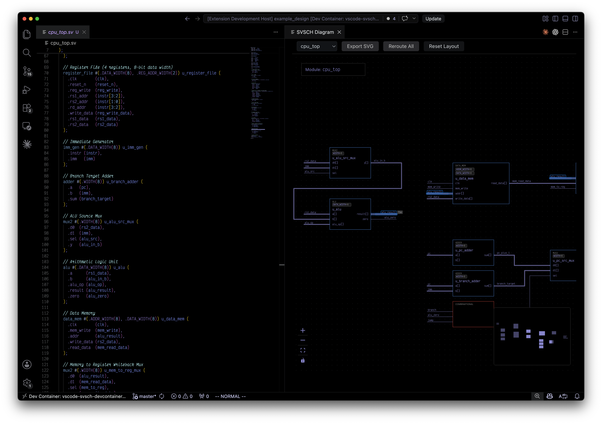

# svsch

SystemVerilog Schematics. Make beautiful vector diagrams of your digital circuits from the comfort
of your IDE.

Check out the [SVSCH Syntax Book](docs/svsch-syntax-book.md) for a visual reference of supported SystemVerilog constructs and their generated block diagrams.

Notable features:
* live updates: diagram is updated in real time after the code is updated
* source code nagivation: double click on the diagram node to highlight the corresponding SV
* SVG export: diagram is exported with a complete stylesheet used in the extension and can be
  modified manually after export

