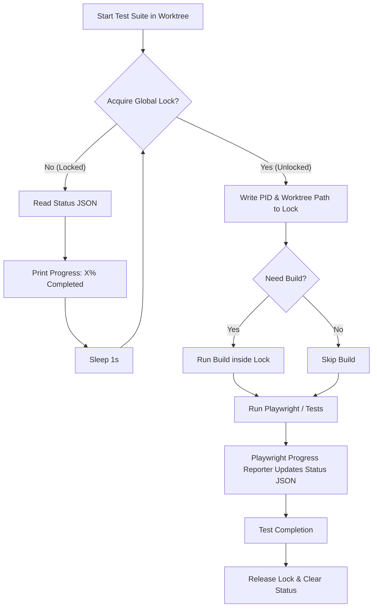

# Design Plan: Worktree Test Suite Locking and Rebuilding Orchestrator

This document outlines the architecture and implementation plan for preventing test conflicts, reducing flakiness, displaying test progress across different git worktrees, and ensuring correct builds before test runs.

---

## 1. Background & Audit of Test Suites

The codebase contains several test suites defined in [package.json](file:///workspaces/svsch/package.json):

| Test Suite | Command / Entrypoint | Key Resources & Dependencies | Conflict Potential |
| :--- | :--- | :--- | :--- |
| **`test:visual`** | `playwright test` | Vite Dev Server (port `5174`/`SVSCH_VISUAL_PORT`), Playwright, C++ Backend (`dist/svsch_backend`) | **High**. Vite server port collisions; `playwright.config.ts` reuses existing servers (leading to running tests against another worktree's code). |
| **`test:bdd`** | `playwright test --config test/bdd/playwright.config.ts` | Playwright, BDD Gen, VS Code / Electron under `xvfb-run`, `dist/` | **Critical**. Heavy CPU/Memory usage (spawns multiple VS Code instances). Shared Xvfb server and potential Electron/VS Code debug port collisions. |
| **`test:system`** | `node -e ...` -> runs `test:system:single` per version | Playwright, VS Code / Electron under `xvfb-run` | **Critical**. Spawns multiple VS Code / Electron processes across multiple versions, causing severe CPU/IO overload and flakiness. |
| **`test:syntax`** | `playwright test --config test/syntax-book/playwright.config.ts` | Vite Dev Server (port `5174`), Playwright | **High**. Same Vite port collisions and server reuse issues as `test:visual`. |
| **`test:backend`** | `cmake --build ...` + test binary run | Ninja, C++ compiler, CPU cores | **Medium**. High CPU load during Ninja build and test runs, leading to contention/flakiness for other suites. |
| **`test`** (Vitest) | `vitest run` | Vitest, CPU cores | **Low**. Fast, but still adds CPU stress. |

### Conclusion of Audit:
To prevent flakiness and port/server collisions, **all Playwright-based test suites and heavy build processes must acquire a machine-wide global lock**. Only one suite should run (or build) at any given time.

---

## 2. Core Components Architecture

We will implement three main components to orchestrate this:
1. **Global Test Lock Manager (`/tmp/svsch-global-test.lock`)**: A lockfile created atomically using POSIX-compatible flags in Node.js.
2. **Progress & Status Server/File (`/tmp/svsch-global-test-status.json`)**: A shared JSON file updated by the running process and monitored by waiting CLI runners.
3. **Smart Build Checker**: An incremental build checking system that verifies source file updates before starting tests.



---

## 3. Implementation Details

### A. The Lock Manager (`scripts/run-test.js`)
We will create a central runner script `scripts/run-test.js`.
- It will handle locking using atomic operations (`fs.openSync(lockPath, 'wx')`).
- **Stale Lock Recovery**: If a lock is held, the script will read the PID from the lock file and check if that process is still running (e.g. `process.kill(pid, 0)`). If the process is dead, the script will break the lock automatically.
- **Polling & UI**: When waiting, it will clear the current console line and print the progress dynamically:
  ```
  [SVSCH Test Runner] Waiting for Worktree '/workspaces/svsch-feature' running 'test:bdd' (PID 12345)...
  Progress: [████░░░░░░░░] 33% (14/42 tests completed)
  ```

### B. Custom Playwright Reporter (`scripts/playwright-progress-reporter.ts`)
To update progress dynamically:
- We will add a custom reporter to Playwright configurations.
- On test start (`onBegin`), it calculates the total count.
- On test end (`onTestEnd`), it increments the count and updates `/tmp/svsch-global-test-status.json`.
- This works automatically across BDD, system, and visual tests.

### C. Build Protocol and Caching
- **Isolation**: Each worktree has its own `./dist/` directory. Building in Worktree A does not affect or overwrite Worktree B.
- **Protocol**: To ensure changes are not lost and we run the correct code, we check:
  1. Have extension TS files under `src/` changed since `dist/extension.js` was built?
  2. Have webview React files under `src/webview/` changed since `dist/index.html` was built?
  3. Have C++ files under `src/parser/backend_cpp/` changed since `dist/svsch_backend` was built?
- If changes are detected, the runner automatically compiles them **after** acquiring the lock (to avoid build CPU load causing test flakiness in other worktrees).

---

## 4. Proposed Changes to Configuration

We will wrap test scripts in `package.json` with the new runner:
```json
{
  "scripts": {
    "test:bdd": "node scripts/run-test.js bdd",
    "test:visual": "node scripts/run-test.js visual",
    "test:system:single": "node scripts/run-test.js system:single",
    "test:syntax": "node scripts/run-test.js syntax"
  }
}
```

---

## 5. Next Steps & User Feedback

1. **Verify Lock Location**: Since all worktrees run on the same Linux host, using `/tmp` is perfect. Should we use `/tmp` or another shared directory?
2. **Vitest & C++ tests**: Do you want us to lock Vitest (`test`) and C++ unit tests (`test:backend`) under the same lock, or keep them unlocked because they do not spin up Playwright/Electron? (We recommend locking everything, as heavy CPU compilation during Ninja build will cause Playwright timeouts).
3. **Build optimization**: Does the incremental build check logic (comparing file modification times) look good, or do you prefer a simpler check (e.g., always building inside the lock)?

---

## 6. Implementation Status (July 6, 2026) - **Completed**

The plan has been fully implemented in the active git worktree `agents/locking-and-building`:
- **Centralized Lock & Rebuild Manager**: Created [scripts/run-test.js](file:///workspaces/svsch/.agents/worktrees/locking-and-building/scripts/run-test.js) to manage POSIX atomic file locking, stale lock checks (checking if the process PID is still alive), terminal status updates, and automated build checks comparing source file `mtime` with output file `mtime`.
- **Playwright Progress Reporter**: Created [scripts/playwright-progress-reporter.js](file:///workspaces/svsch/.agents/worktrees/locking-and-building/scripts/playwright-progress-reporter.js) to write current test suite completion percentages to the shared status JSON.
- **Config & Playwright Configurations**: Registered the progress reporter in [playwright.config.ts](file:///workspaces/svsch/.agents/worktrees/locking-and-building/playwright.config.ts), [test/bdd/playwright.config.ts](file:///workspaces/svsch/.agents/worktrees/locking-and-building/test/bdd/playwright.config.ts), and [test/system/playwright.config.ts](file:///workspaces/svsch/.agents/worktrees/locking-and-building/test/system/playwright.config.ts).
- **Unified package.json Test Targets**: Updated all test entries in [package.json](file:///workspaces/svsch/.agents/worktrees/locking-and-building/package.json) to route through the central orchestrator script.
- **Verification**: Verified concurrent executions of unit/visual tests. One suite waits, displays the other worktree's execution details/progress, and runs successfully once the lock is released.

